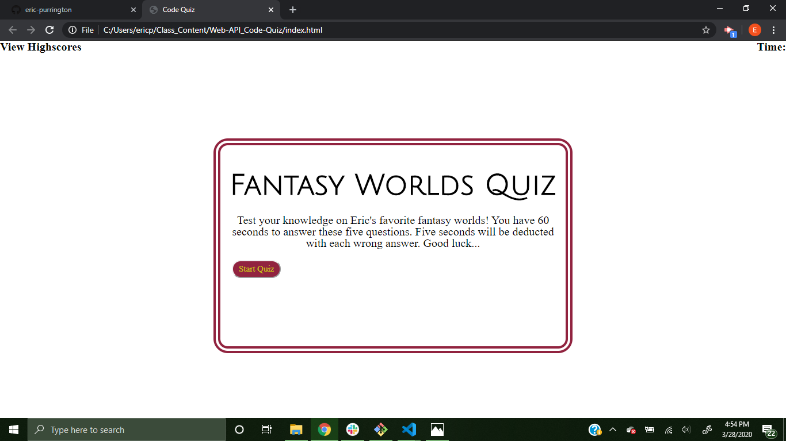

# Web-API_Code-Quiz
Homework 4 -> A quiz featuring some of my favorite worlds.
## Link to the running quiz
https://eric-purrington.github.io/Web-API_Code-Quiz/

## Start Page

## How it works
User clicks start button to start the quiz and timer or highscores at the top left to view highscores. Timer is shown on the top right ticking down as the quiz runs on. With each answer chosen the quiz lets you know if you were right or wrong. After the 5th question the user is given a page in which they can enter their initials. On submit of the initials, the highscores are shown with options to clear highscores or restart the quiz.

## Languages used
I love JavaScript, so the majority of the code is written in that language.
### HTML
The index.html file is nearly blank with just four tags in the body including the script. I wanted to prove to myself that I could make a functioning quiz without it.  
### CSS
As far as styling, it is fairly minimal with some margin and padding added to elements to get the right framework. Some fonts and colors were also added, of course.
### JavaScript
As stated above, most of the goods are in the script.js. I used an array with objects holding the questions and answers, functions to run each page, a timer, and loops to capture, sort, and store highscores. 

## Tech used from others
I used a few fonts from Google Fonts to spice up the look of the questions. Link below.                                                                                                       
I also used a css reset to ensure my styling wasn't overridden by the user's browser. Link below.

https://fonts.googleapis.com/css?family=Amatic+SC:700|Bilbo|Elsie|Julius+Sans+One|Marvel:700|Orbitron:600&display=swap            
https://meyerweb.com/eric/tools/css/reset/